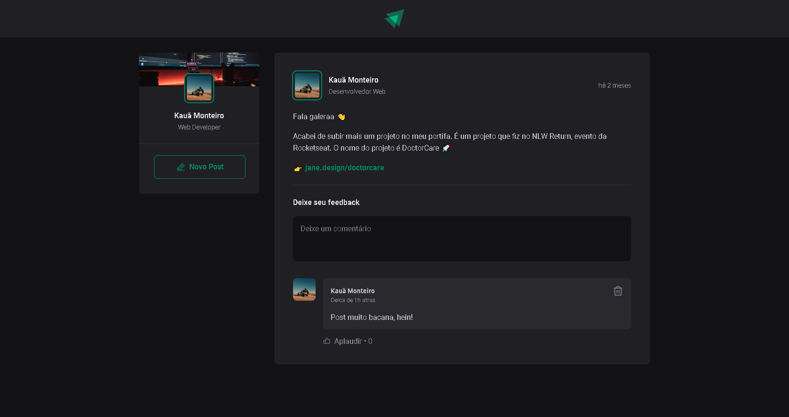

# Ignite App

Desenvolvido no curso da Rocketseat funciona como um rede social de pessoas da área da tecnologia, integrei junto a ele um banco de dados e uma API REST.



## Instalação

Para executar este projeto localmente, siga estas etapas:

1. Clone o repositório para o seu ambiente local:

    ```
    git clone https://github.com/kauamntro/IgniteApp.git
    ```

Primeiro o backend para rodar os posts

2. Instale as dependências do projeto:

    ```
    npm install
    ```

3. Ir pasta principal do back:

    ```
    cd back_end
    ```

4. Iniciar Docker Compose (App tem de estar aberto):

    ```
    docker-compose up -d
    ```

5. Rodar a API (Outro terminal na pasta back_end):

    ```
    node .
    ```

Agora no frontend:

6. Ir pasta principal do front:

    ```
    cd front_end
    ```

7. Execute o projeto:

    ```
    npm run dev
    ```

8. No navegador abrir o [localhost](http://localhost:5173/).

## Me siga

[Linkedin](https://www.linkedin.com/in/kauamntro/) e [Instagram](https://www.instagram.com/code.kaua/)
